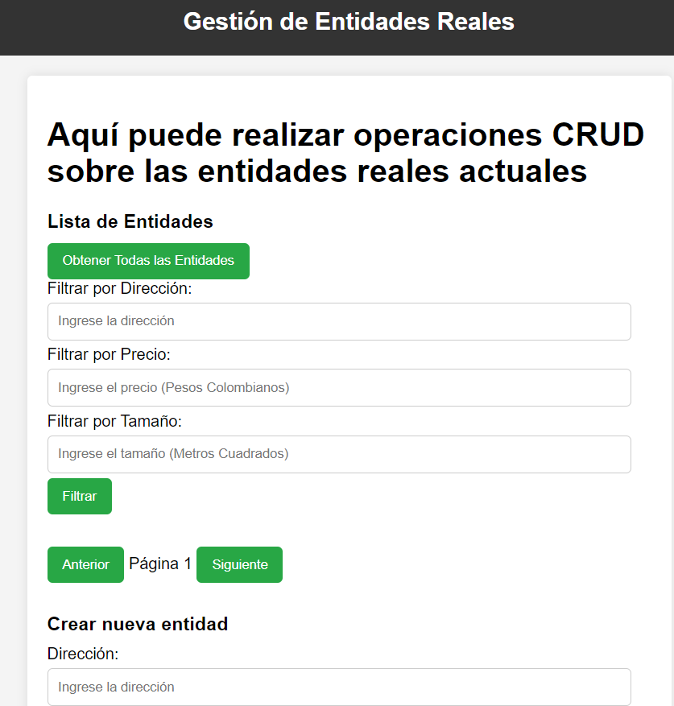
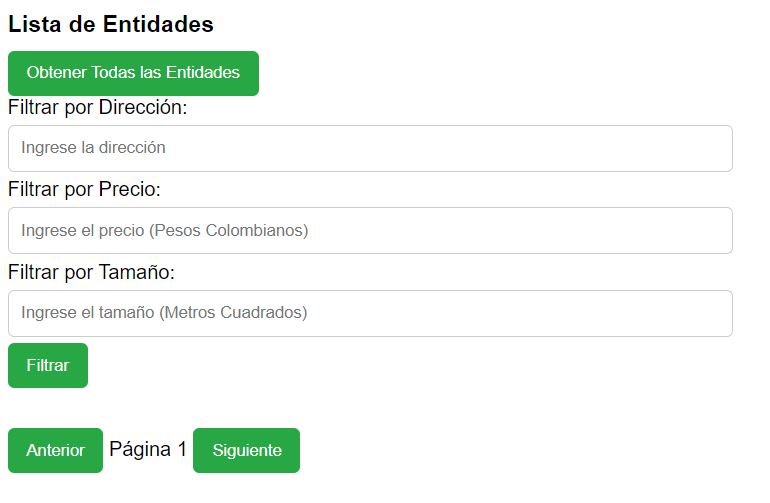
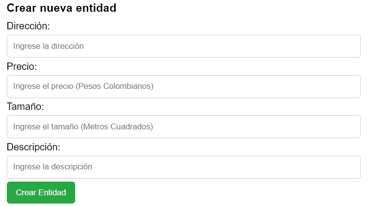
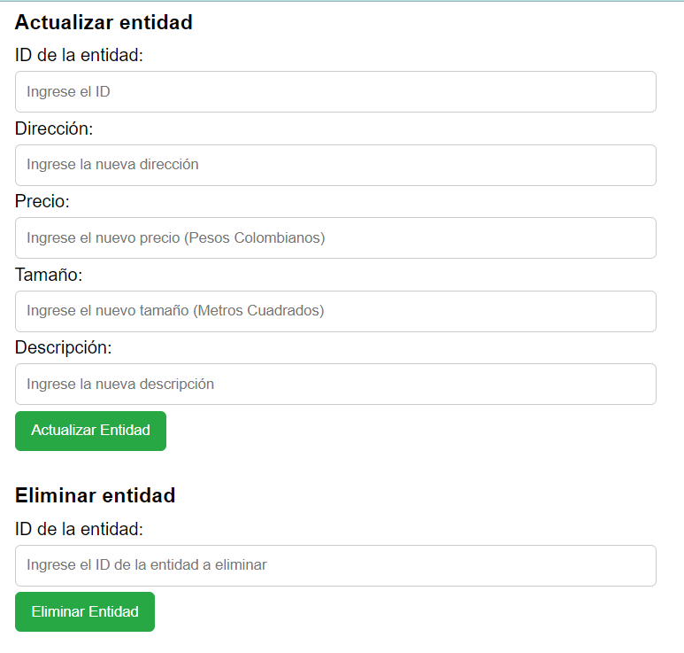
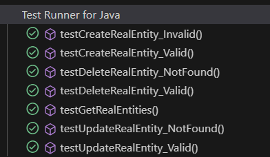
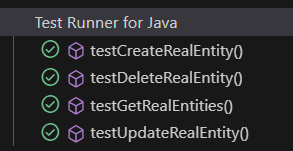

# TALLER  SISTEMA CRUD PARA GESTIONAR PROPIEDADES

En esta aplicación implementa un sistema CRUD en AWS para gestionar propiedades inmobiliarias, este está compuesto por un componente de Spring que contiene tanto el backend como el frontend y actúa como intermediario entre el usuario y el componente de base de datos MySQL. Además, a la aplicación se agregaron las funcionalidades de paginación, búsqueda y comentarios añadiéndole atributos de calidad a la misma.

## Arquitectura

1. **Componente Spring (Backend + Frontend):**
   - El frontend está integrado en el mismo servidor que el backend y se comunica directamente con los controladores y servicios REST expuestos por el backend de Spring.
   - El backend utiliza el patrón de diseño MVC, además de servir el frontend, maneja la lógica de negocio para realizar las operaciones CRUD, gestiona peticiones HTTP y utiliza datos provenientes de la base de datos.
2. **Componente MySQL (Base de datos):** 
   - Este componente es la base de datos MySQL que está en un servidor separado.
     El componente Spring se comunica con MySQL a través de una conexión de red utilizando Spring Data JPA para realizar operaciones de lectura y escritura en la base de datos.
## Empezando

### Requisitos Previos
Para ejecutar este proyecto, necesitarás tener instalado:

- Java JDK 17.
- Un IDE de Java como IntelliJ IDEA, Eclipse, o NetBeans.
- Maven para manejar las dependencias preferiblemente la version 3.9.4 
- Un navegador web para interactuar con el servidor.


### Instalación

1. Tener instalado Git en tu máquina local
2. Elegir una carpeta en donde guardes tu proyecto
3. abrir la terminal de GIT --> mediante el click derecho seleccionas Git bash here
4. Clona el repositorio en tu máquina local:
   ```bash
   git clone https://github.com/ChristianDuarteR/Taller-CRUD.git
   ```
5. **IMPORTANTE**: 
   - En application.properties tiene que cambiar el usuario en ***spring.datasource.username*** utilice root o la que tenga predefinida.
   - En **spring.datasource.password** cambié la contraseña por la de su base de datos. 
   - En **spring.datasource.url** en jdbc:mysql://TuIP:3306 cambié su IP por localhost o una específica como la de AWS. 
   - Finalmente, Recuerde que el nombre de la base es arep


## Deployment
1. Abre los dos proyectos con tu IDE favorito o navega hasta el directorio del proyecto
2. Desde la terminal para compilar y empaquetar el proyecto ejecuta:

   ```bash
   mvn clean install
   ```
3.  Compila el proyecto que contiene el método MAIN: JpaDemoApplication o ejecuta desde la terminal

   ```bash
   mvn spring-boot:run
   ```
Verá que el servidor está listo y corriendo sobre el puerto 8080

4. Puedes interactuar con los endpoints RESTful API con:
    - http://localhost:8080
    
    - 
    - 
    - 

   
## Despliegue en AWS

- **Video**: 
[despliegue en AWS funcionando](https://drive.google.com/file/d/1f6Uimyly4tvDkSJjK5PauKAB-H_fiFk3/view?usp=drivesdk)


## Ejecutar las pruebas

El proyecto incluye pruebas unitarias que simulan el comportamiento del servicio y del controlador con su respectivo manejo de errores: 
1. Desde la terminal ejecutas:
   ```bash
   mvn test
   ```
### Desglosar en pruebas de extremo a extremo
- **testGetRealEntities**: Prueba el método GET para obtener todas las entidades.
- **testCreateRealEntity**: Prueba el método POST para crear una nueva entidad.
- **testUpdateRealEntity**: Prueba el método PUT para actualizar una entidad existente.
- **testDeleteRealEntity** Prueba el método DELETE para eliminar una entidad.
- **testGetRealEntities**: Prueba para obtener todas las entidades.
- **testCreateRealEntity_Valid**: Prueba para crear una entidad válida.
- **testCreateRealEntity_Invalid**:Prueba para crear una entidad inválida (dirección nula).
- **testUpdateRealEntity_Valid**: Prueba para actualizar una entidad existente con datos válidos.
- **testUpdateRealEntity_NotFound**:Prueba para actualizar una entidad que no existe (debe lanzar `EntityNotFoundException`).
- **testDeleteRealEntity_Valid**:Prueba para eliminar una entidad existente.
- **testDeleteRealEntity_NotFound**:Prueba para eliminar una entidad que no existe (debe lanzar `EntityNotFoundException`).
### Ejemplo
 ```bash
  // Prueba el método GET para obtener todas las entidades.
	@Test
	public void testGetRealEntities() {
		// Arrange: Configura los datos simulados para la prueba.
		RealEntity realEntity1 = new RealEntity();  // Simula la primera entidad.
		RealEntity realEntity2 = new RealEntity();  // Simula la segunda entidad.
		List<RealEntity> realEntities = Arrays.asList(realEntity1, realEntity2);  // Lista de entidades simuladas.

		// Simula el comportamiento del servicio para retornar la lista de entidades.
		when(realEntityService.getRealEntities()).thenReturn(realEntities);

		// Act: Llama al método del controlador.
		ResponseEntity<List<RealEntity>> response = realEntityController.getAllEntities();

		// Assert: Verifica que el código de estado sea 200 (OK) y que el cuerpo de la respuesta sea correcto.
		assertEquals(HttpStatus.OK, response.getStatusCode());
		assertEquals(realEntities, response.getBody());
	}
      
   ```




## Built With
* [Maven](https://maven.apache.org/) - Dependency Management

## Authors

* **Christian Javier Duarte Rojas** - [ChristianDuarteR ](https://github.com/ChristianDuarteR )